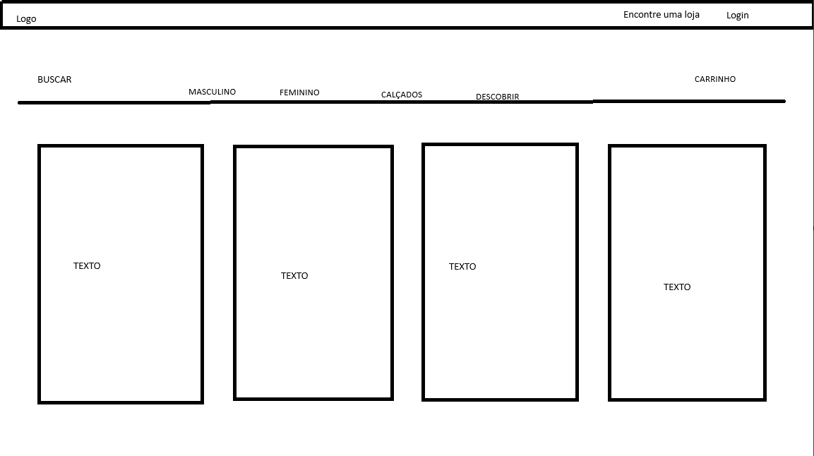

# Trabalho Prático - Semana 03

Dessa vez, vamos escolher uma proposta de projeto para trabalhar.

Nessa atividade, você deverá montar a página inicial do projeto escolhido, a organização do HTML aplicando semântica correta e uso aprimorado do CSS. Leia o enunciado completo no Canvas para mais detalhes.

**IMPORTANTE:** Você deve trabalhar e alterar apenas arquivos dentro da pasta **`public`**. Deixe todos os demais arquivos e pastas desse repositório inalterados. **PRESTE MUITA ATENÇÃO NISSO.**

## Informações Gerais

- Nome: Caio Fernandes de Albuquerque
- Matricula: 901324
- Proposta de projeto escolhida: clone da loja da arc,teryx
- Breve descrição sobre seu projeto: usei a pagian de compras dele como inspriração para meu projeto, usando a aba masculino, feminino, calçados e descobrir para dar um visual bom para a pagina.

## Print do(s) wireframe(s) criado

## Print da home-page criada

<<  COLOQUE A IMAGEM AQUI >>
